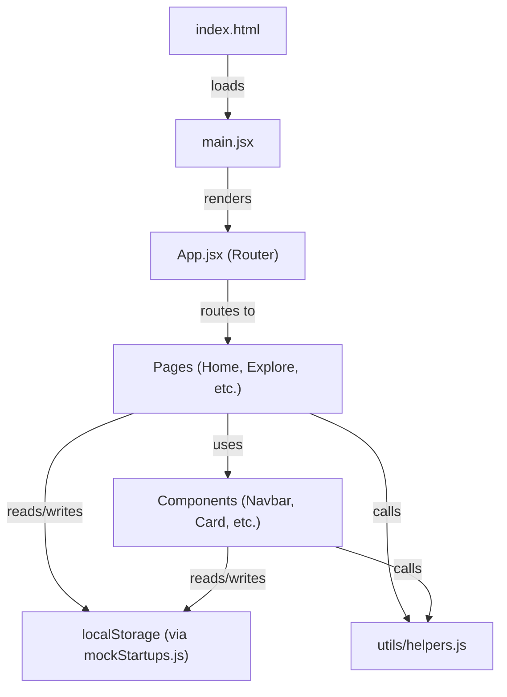

# UniVenture — Complete Viva Preparation Guide

> **Project**: UniVenture — A startup pitching platform for college founders  
> **Tech Stack**: React 19 + Vite 7 + TailwindCSS v4 + React Router v7  
> **Purpose**: This document explains **every single file and line of code** in your project and teaches you the React concepts behind them.

---

## Table of Contents

1. [Project Overview & Architecture](#1-project-overview--architecture)
2. [Technology Stack Deep Dive](#2-technology-stack-deep-dive)
3. [Configuration Files](#3-configuration-files)
4. [Entry Point — main.jsx & App.jsx](#4-entry-point--mainjsx--appjsx)
5. [Global Styles — index.css](#5-global-styles--indexcss)
6. [Data Layer — mockStartups.js](#6-data-layer--mockstartupsjs)
7. [Custom Hooks — useLocalStorage.js](#7-custom-hooks--uselocalstorejs)
8. [Utility Functions — helpers.js](#8-utility-functions--helpersjs)
9. [Components (Detailed Breakdown)](#9-components-detailed-breakdown)
10. [Pages (Detailed Breakdown)](#10-pages-detailed-breakdown)
11. [React Concepts Used in This Project](#11-react-concepts-used-in-this-project)
12. [Future Improvements](#12-future-improvements)
13. [Viva Questions & Answers](#13-viva-questions--answers)

---

## 1. Project Overview & Architecture

UniVenture is a **single-page application (SPA)** where college students can:
- **Pitch** their startup ideas with detailed problem/solution statements
- **Explore** and filter startups by domain, role, and popularity
- **Vote**, **save**, and **comment** on pitches
- **Build teams** by requesting collaboration
- **Sign up** as a Student (founder) or Investor

### Folder Structure

```
UniVenture/
├── index.html            ← Single HTML page (the "S" in SPA)
├── package.json          ← Dependencies & scripts
├── vite.config.js        ← Build tool configuration
├── src/
│   ├── main.jsx          ← React entry point — mounts the app
│   ├── App.jsx           ← Root component — defines all routes
│   ├── index.css         ← Global styles, animations, design tokens
│   ├── components/       ← Reusable UI building blocks
│   │   ├── Avatar.jsx
│   │   ├── FilterBar.jsx
│   │   ├── Footer.jsx
│   │   ├── Navbar.jsx
│   │   ├── StartupCard.jsx
│   │   ├── StatsBar.jsx
│   │   ├── TagBadge.jsx
│   │   └── VoteButton.jsx
│   ├── pages/            ← Full-page views (one per route)
│   │   ├── Home.jsx
│   │   ├── Explore.jsx
│   │   ├── PitchDetail.jsx
│   │   ├── SubmitPitch.jsx
│   │   ├── Profile.jsx
│   │   ├── Dashboard.jsx
│   │   ├── Login.jsx
│   │   └── Signup.jsx
│   ├── data/
│   │   └── mockStartups.js  ← Seed data + localStorage CRUD functions
│   ├── hooks/
│   │   └── useLocalStorage.js  ← Custom hook for persistent state
│   └── utils/
│       └── helpers.js    ← Utility functions (formatting, IDs, etc.)
```

### How Data Flows



---

## 2. Technology Stack Deep Dive

| Technology | Version | Purpose |
|---|---|---|
| **React** | 19.2.0 | UI library — builds the component tree |
| **React DOM** | 19.2.0 | Renders React components to the browser DOM |
| **React Router DOM** | 7.14.0 | Client-side routing — navigates without page reloads |
| **Vite** | 7.3.1 | Build tool — blazing fast dev server + bundler |
| **TailwindCSS** | 4.2.2 | Utility-first CSS framework |
| **Lucide React** | 1.8.0 | Icon library (tree-shakable SVG icons) |

### Why Vite over Create React App (CRA)?

| Aspect | Vite | CRA |
|---|---|---|
| Dev server startup | ~300ms (instant) | ~10-30s |
| Hot Module Replacement | Instant | Slower |
| Build speed | esbuild (Go-based) | Webpack (JS-based) |
| Config needed | Minimal | Hidden (ejectable) |
| Status | Actively maintained | Deprecated as of 2023 |

---

## 3. Configuration Files

### 3.1 `package.json`

```json
{
  "name": "univenture",          // Project name — used by npm
  "private": true,               // Prevents accidental publish to npm
  "version": "0.0.0",            // Semantic versioning
  "type": "module",              // Enables ES Modules (import/export instead of require)
  "scripts": {
    "dev": "vite",               // Starts dev server → npm run dev
    "build": "vite build",       // Creates production bundle → dist/
    "lint": "eslint .",          // Checks code quality
    "preview": "vite preview"    // Serves built dist/ locally
  },
  "dependencies": {              // Packages shipped to production
    "@tailwindcss/vite": "^4.2.2",   // Tailwind v4 Vite plugin
    "lucide-react": "^1.8.0",        // SVG icon library
    "react": "^19.2.0",              // React core
    "react-dom": "^19.2.0",          // React DOM renderer
    "react-router-dom": "^7.14.0",   // Client-side routing
    "tailwindcss": "^4.2.2"          // Utility CSS framework
  },
  "devDependencies": {            // Only needed during development
    "@vitejs/plugin-react": "^5.1.1",   // Vite's React support (Fast Refresh)
    "eslint": "^9.39.1",                // Linter
    "vite": "^7.3.1"                    // Build tool
  }
}
```

> [!NOTE]
> The `^` prefix (e.g., `^19.2.0`) means "compatible with" — allows minor & patch updates but not major version changes.

### 3.2 `vite.config.js`

```js
import { defineConfig } from 'vite'      // Vite's config helper (type-safe)
import react from '@vitejs/plugin-react'  // Enables JSX, Fast Refresh
import tailwindcss from '@tailwindcss/vite' // Tailwind v4 Vite integration

export default defineConfig({
  plugins: [react(), tailwindcss()],
  // react()       → transforms JSX to JS, enables hot module replacement
  // tailwindcss() → processes Tailwind utility classes at build time
})
```

### 3.3 `index.html`

This is the **only HTML file** in the entire app. React "takes over" the `<div id="root">`.

```html
<!doctype html>
<html lang="en">
  <head>
    <meta charset="UTF-8" />                    <!-- Character encoding -->
    <link rel="icon" href="data:image/svg+xml,..." />  <!-- Inline SVG favicon (no extra file needed) -->
    <meta name="viewport" content="width=device-width, initial-scale=1.0" />  <!-- Responsive -->
    <meta name="description" content="UniVenture — Where college ideas..." />  <!-- SEO -->
    <title>UniVenture — Pitch Your Startup</title>

    <!-- Google Fonts: DM Sans (body), Syne (headings), JetBrains Mono (code/numbers) -->
    <link rel="preconnect" href="https://fonts.googleapis.com">
    <link href="https://fonts.googleapis.com/css2?family=DM+Sans...&family=Syne...&family=JetBrains+Mono..." rel="stylesheet">
  </head>
  <body class="bg-[#F8FAFF] text-[#1A1A2E] antialiased">
    <div id="root"></div>                <!-- React mounts here -->
    <script type="module" src="/src/main.jsx"></script>  <!-- Entry point -->
  </body>
</html>
```

> [!IMPORTANT]
> **Why `type="module"`?** — This tells the browser to treat the script as an ES Module, enabling `import`/`export` syntax natively.

---

## 4. Entry Point — main.jsx & App.jsx

### 4.1 `main.jsx` — The Bootstrap File

```jsx
import { StrictMode } from 'react'               // 1. Import StrictMode (catches bugs in dev)
import { createRoot } from 'react-dom/client'     // 2. Import the React 18+ renderer
import { BrowserRouter } from 'react-router-dom'  // 3. Import the router wrapper
import './index.css'                               // 4. Import global styles
import App from './App.jsx'                        // 5. Import the root component

createRoot(document.getElementById('root'))  // 6. Find <div id="root"> in index.html
  .render(                                   // 7. Render the component tree into it
    <StrictMode>         {/* Enables extra warnings in development */}
      <BrowserRouter>    {/* Enables <Link>, <Route>, useNavigate, etc. */}
        <App />          {/* Your root component */}
      </BrowserRouter>
    </StrictMode>,
  )
```

**React Concepts Used:**
- **`createRoot`** — React 18+ API. The old way was `ReactDOM.render()`.
- **`StrictMode`** — Runs components twice in dev to detect side effects (no effect in production).
- **`BrowserRouter`** — Uses HTML5 History API for clean URLs (`/explore` instead of `/#/explore`).

### 4.2 `App.jsx` — The Route Map

```jsx
import { Routes, Route } from 'react-router-dom';  // Routing components
import { useEffect } from 'react';                  // Side-effect hook
import { initData } from './data/mockStartups';      // Data initializer

// Import all page components
import Home from './pages/Home';
import Explore from './pages/Explore';
// ... (6 more imports)

export default function App() {
  // useEffect runs ONCE after the first render ([] = empty dependency array)
  useEffect(() => {
    initData();   // Seeds localStorage with sample data if not already present
  }, []);

  return (
    <div className="min-h-screen bg-[#F8FAFF] text-[#1A1A2E] font-[DM_Sans]">
      <Routes>
        {/* Each <Route> maps a URL path to a component */}
        <Route path="/"            element={<Home />} />
        <Route path="/explore"     element={<Explore />} />
        <Route path="/pitch/:id"   element={<PitchDetail />} />   {/* :id = dynamic parameter */}
        <Route path="/submit"      element={<SubmitPitch />} />
        <Route path="/profile/:id" element={<Profile />} />       {/* :id = dynamic parameter */}
        <Route path="/dashboard"   element={<Dashboard />} />
        <Route path="/login"       element={<Login />} />
        <Route path="/signup"      element={<Signup />} />
      </Routes>
    </div>
  );
}
```

**React Concepts Used:**
- **`useEffect`** — Runs side effects (data fetching, subscriptions, etc.) after render
- **`Routes` / `Route`** — Declarative routing; only the matching route renders
- **Dynamic segments (`:id`)** — The `:id` in `/pitch/:id` captures a URL parameter. Accessed via `useParams()` in the child component.

---

## 5. Global Styles — index.css

This file defines the **design system** for the entire app.

### Key Sections

| Section | What It Does |
|---|---|
| `@import "tailwindcss"` | Loads Tailwind v4's base, components, and utilities |
| `@theme { ... }` | Defines custom design tokens (colors, fonts, animations) |
| `@keyframes` (15+ animations) | Custom CSS animations for float, pulse, fade, slide, bounce, confetti, etc. |
| Base Styles | Scroll behavior, font smoothing, custom scrollbar |
| Utility Classes | `.grid-pattern`, `.glass`, `.card-premium`, `.btn-ripple`, `.shimmer`, `.text-gradient`, etc. |

### Design Tokens (in `@theme`)

```css
@theme {
  --color-violet: #6C63FF;   /* Primary brand color */
  --color-cyan: #00B4D8;     /* Secondary accent */
  --color-success: #10B981;  /* Green for success states */
  --color-warning: #F59E0B;  /* Amber for warnings */
  --color-danger: #EF4444;   /* Red for errors */
  --font-syne: 'Syne';       /* Bold headings */
  --font-dm: 'DM Sans';      /* Body text */
  --font-mono: 'JetBrains Mono'; /* Numbers, code */
}
```

### Notable CSS Techniques

1. **Gradient text**: Uses `background-clip: text` to make text appear as a gradient
2. **Glassmorphism (`.glass`)**: `backdrop-filter: blur(20px)` creates frosted glass
3. **Gradient border (`.gradient-border`)**: Uses CSS mask trick to show gradient only on borders
4. **Mask composite**: `-webkit-mask-composite: xor` excludes the content area from the border mask
5. **Stagger animations**: `.stagger-1` through `.stagger-6` add incremental delays

---

## 6. Data Layer — mockStartups.js

This is the **data backbone** of the app. Since there's no backend server, all data lives in `localStorage`.

### Constants Exported

| Constant | Type | Purpose |
|---|---|---|
| `DOMAINS` | Array of `{name, icon, color}` | The 6 startup categories |
| `ROLE_OPTIONS` | Array of strings | Roles like Developer, Designer, etc. |
| `MARKET_SIZES` | Array of strings | `<₹10Cr`, `₹10-100Cr`, `₹100Cr+` |
| `FUNDING_TYPES` | Array of strings | Equity, Grant, Revenue Share |
| `REVENUE_MODELS` | Array of strings | SaaS, Freemium, Commission, etc. |
| `SAMPLE_STARTUPS` | Array of 12 objects | Pre-built startup data |
| `DEFAULT_USER` | Object | Default logged-in user profile |
| `SAMPLE_REQUESTS` | Array | Collaboration requests |
| `SAMPLE_ACTIVITY` | Array | Activity feed items |

### Startup Object Shape

```js
{
  id: 'startup-001',              // Unique identifier
  title: 'EduBot AI',             // Startup name
  tagline: '...',                  // One-liner description
  domain: 'EdTech',               // Category
  tags: ['AI', 'B2C'],            // Searchable tags
  problem: '...',                  // Problem statement
  solution: '...',                 // Solution description
  market: '...',                   // Target market
  traction: '...',                 // Current progress
  fundingAsk: 2000000,            // Amount in ₹
  fundingType: 'Equity',          // Type of funding
  marketSize: '₹100Cr+',          // Market size bracket
  revenueModel: 'Freemium',       // How they make money
  votes: 127,                     // Community votes
  views: 892,                     // Page views
  comments: [{ id, author, text, date }],  // Comments array
  saves: 45,                      // Number of saves
  rolesNeeded: ['Developer'],     // Open positions
  founders: [{ name, college, role }],  // Team members
  contactEmail: '...',            // Contact info
  demoVideo: 'https://...',       // YouTube embed URL
  postedAt: '2024-01-15T10:30:00Z',  // ISO date
  isTrending: true                // Whether it's trending
}
```

### CRUD Functions

```js
// INITIALIZE — Seeds data with version control
export function initData() {
  const DATA_VERSION = 'v4-refined-ui';
  // If version doesn't match, re-seed data (ensures updates propagate)
  if (localStorage.getItem('uv_version') !== DATA_VERSION) {
    localStorage.setItem('uv_startups', JSON.stringify(SAMPLE_STARTUPS));
    localStorage.setItem('uv_user', JSON.stringify(DEFAULT_USER));
    // ... more seeds
    localStorage.setItem('uv_version', DATA_VERSION);
  }
}

// READ — Get data from localStorage, fallback to defaults
export function getStartups() {
  const data = localStorage.getItem('uv_startups');
  return data ? JSON.parse(data) : SAMPLE_STARTUPS;
}

// WRITE — Save data to localStorage
export function saveStartups(startups) {
  localStorage.setItem('uv_startups', JSON.stringify(startups));
}
```

> [!TIP]
> **Version control pattern**: `DATA_VERSION` ensures that when you update mock data, old cached data in users' browsers gets replaced.

---

## 7. Custom Hooks — useLocalStorage.js

```js
import { useState, useEffect } from 'react';

export function useLocalStorage(key, initialValue) {
  // 1. LAZY INITIALIZATION: The function inside useState runs ONCE
  //    It checks localStorage first, falls back to initialValue
  const [value, setValue] = useState(() => {
    try {
      const stored = localStorage.getItem(key);
      return stored ? JSON.parse(stored) : initialValue;
    } catch {
      return initialValue;  // If JSON parsing fails, use default
    }
  });

  // 2. SYNC TO STORAGE: Whenever value OR key changes, persist it
  useEffect(() => {
    try {
      localStorage.setItem(key, JSON.stringify(value));
    } catch {
      // Storage full or unavailable — fail silently
    }
  }, [key, value]);  // Dependency array: runs when key or value changes

  // 3. Return EXACTLY the same API as useState: [value, setter]
  return [value, setValue];
}
```

**React Concept — Custom Hooks:**
- A custom hook is a **function that starts with `use`** and calls other hooks
- It lets you **extract and reuse stateful logic** across multiple components
- This hook works like `useState` but **automatically persists to localStorage**

---

## 8. Utility Functions — helpers.js

### `generateId()` — Unique ID Generator

```js
export function generateId() {
  return 'startup-' + Date.now().toString(36) + Math.random().toString(36).slice(2, 6);
  // e.g., "startup-m5x3k7f9a2b1"
  // Date.now().toString(36) → converts timestamp to base-36 (compact)
  // Math.random()... → adds 4 random characters for uniqueness
}
```

### `getAvatarColor(name)` — Deterministic Color from Name

```js
export function getAvatarColor(name) {
  let hash = 0;
  for (let i = 0; i < name.length; i++) {
    hash = name.charCodeAt(i) + ((hash << 5) - hash);
    // charCodeAt gives ASCII code; bit-shifting creates spread
  }
  const hue = Math.abs(hash % 360);  // Map to 0–360 (color wheel)
  return `hsl(${hue}, 65%, 55%)`;    // HSL gives vibrant, consistent colors
}
```

> [!TIP]
> **Why HSL?** — By fixing saturation (65%) and lightness (55%), we guarantee every color is vibrant and readable. Only the hue varies, ensuring visual consistency.

### `getInitials(name)` — Extracts Initials

```js
export function getInitials(name) {
  return name
    .split(' ')           // "Priya Sharma" → ["Priya", "Sharma"]
    .map(n => n[0])       // → ["P", "S"]
    .join('')             // → "PS"
    .toUpperCase()        // → "PS"
    .slice(0, 2);         // Max 2 characters
}
```

### `formatFunding(amount)` — Indian Currency Formatting

```js
export function formatFunding(amount) {
  if (amount >= 10000000) return `₹${(amount / 10000000).toFixed(1)}Cr`;  // Crores
  if (amount >= 100000) return `₹${(amount / 100000).toFixed(0)}L`;       // Lakhs
  if (amount >= 1000) return `₹${(amount / 1000).toFixed(0)}K`;           // Thousands
  return `₹${amount}`;
}
// formatFunding(2000000) → "₹20L"
// formatFunding(10000000) → "₹1.0Cr"
```

### `timeAgo(dateString)` — Relative Time

```js
export function timeAgo(dateString) {
  const seconds = Math.floor((new Date() - new Date(dateString)) / 1000);
  const intervals = [
    { label: 'year', seconds: 31536000 },
    { label: 'month', seconds: 2592000 },
    // ... down to 'minute'
  ];
  for (const interval of intervals) {
    const count = Math.floor(seconds / interval.seconds);
    if (count >= 1) return `${count} ${interval.label}${count > 1 ? 's' : ''} ago`;
  }
  return 'just now';
}
```

### `getDomainInfo(domain)` — Domain Metadata

```js
export function getDomainInfo(domain) {
  const DOMAIN_MAP = {
    'AI/ML': { color: '#6C63FF', gradient: 'from-violet-500 to-purple-600' },
    'FinTech': { color: '#FFB800', gradient: 'from-amber-400 to-orange-500' },
    // ... 4 more
  };
  return DOMAIN_MAP[domain] || { color: '#6C63FF', gradient: '...' };
}
```

---

## 9. Components (Detailed Breakdown)

### 9.1 Avatar.jsx — Initials-Based Avatar

```jsx
import { getInitials, getAvatarColor } from '../utils/helpers';

export default function Avatar({ name, size = 'md', className = '' }) {
  // 1. Compute initials from name (e.g., "Priya Sharma" → "PS")
  const initials = getInitials(name);
  // 2. Compute a deterministic color (same name = same color always)
  const color = getAvatarColor(name);

  // 3. Size mapping — different Tailwind classes per size
  const sizes = {
    xs: 'w-6 h-6 text-[10px]',    // 24px
    sm: 'w-8 h-8 text-xs',         // 32px
    md: 'w-10 h-10 text-sm',       // 40px (default)
    lg: 'w-14 h-14 text-lg',       // 56px
    xl: 'w-20 h-20 text-2xl',      // 80px
    '2xl': 'w-28 h-28 text-4xl',   // 112px
  };

  return (
    <div
      // className combines: circle shape, flex centering, font, size, custom classes
      className={`rounded-full flex items-center justify-center font-semibold font-[Syne] text-white shrink-0 ${sizes[size]} ${className}`}
      style={{ backgroundColor: color }}   // Inline style for dynamic color
    >
      {initials}   {/* Display the initials as text */}
    </div>
  );
}
```

**React Concepts:**
- **Props with defaults**: `size = 'md'` uses destructuring default values
- **Dynamic className**: String interpolation with template literals
- **Inline `style`**: Used for truly dynamic values (color computed at runtime)

---

### 9.2 TagBadge.jsx — Pill-Shaped Tag

```jsx
export default function TagBadge({ tag, onRemove, className = '' }) {
  return (
    <span className={`inline-flex items-center gap-1.5 px-3 py-1 rounded-full text-xs font-mono font-medium bg-[#6C63FF]/5 text-[#6C63FF] border border-[#6C63FF]/15 ${className}`}>
      #{tag}
      {/* Conditional rendering: only show × button if onRemove prop is provided */}
      {onRemove && (
        <button
          onClick={(e) => { e.stopPropagation(); onRemove(tag); }}
          //        ↑ stopPropagation prevents parent's onClick from firing
          className="ml-0.5 text-[#6C63FF]/40 hover:text-[#EF4444] transition-colors"
        >
          ×
        </button>
      )}
    </span>
  );
}
```

**React Concepts:**
- **Conditional rendering with `&&`**: `{onRemove && (...)}` — only renders the button if `onRemove` is a truthy value (function)
- **`e.stopPropagation()`** — Prevents event from bubbling up to parent click handlers
- **Callback props**: `onRemove` is a function passed by the parent

---

### 9.3 StatsBar.jsx — Animated Stat Counters

```jsx
function AnimatedCounter({ target, suffix = '', duration = 1500 }) {
  const [count, setCount] = useState(0);   // Current displayed number
  const ref = useRef(null);                 // DOM reference for Intersection Observer
  const hasAnimated = useRef(false);        // Prevents re-animating

  useEffect(() => {
    // IntersectionObserver watches when the element enters the viewport
    const observer = new IntersectionObserver(
      ([entry]) => {
        if (entry.isIntersecting && !hasAnimated.current) {
          hasAnimated.current = true;   // Only animate once
          animateCount();
        }
      },
      { threshold: 0.3 }   // Trigger when 30% visible
    );
    if (ref.current) observer.observe(ref.current);
    return () => observer.disconnect();   // Cleanup on unmount
  }, [target]);

  function animateCount() {
    const startTime = Date.now();
    const step = () => {
      const elapsed = Date.now() - startTime;
      const progress = Math.min(elapsed / duration, 1);   // 0 → 1
      const eased = 1 - Math.pow(1 - progress, 3);        // Ease-out cubic
      setCount(Math.floor(eased * target));                // Update counter
      if (progress < 1) requestAnimationFrame(step);       // Continue if not done
    };
    requestAnimationFrame(step);   // Start animation loop
  }

  return (
    <span ref={ref} className="font-[Syne] text-3xl md:text-4xl font-bold text-gradient tabular-nums">
      {count}{suffix}
    </span>
  );
}
```

**React Concepts:**
- **`useRef`** — Two uses here: (1) DOM reference for IntersectionObserver, (2) mutable `hasAnimated` flag that survives re-renders without causing them
- **`useRef` vs `useState`** — `useRef` doesn't trigger re-renders when changed; `useState` does
- **`IntersectionObserver`** — Browser API to detect when elements enter/leave the viewport
- **`requestAnimationFrame`** — Schedules smooth animations synced to the display refresh rate

---

### 9.4 VoteButton.jsx — Animated Upvote with Burst Particles

This is the most **complex interactive component**. Let's break it down:

```jsx
export default function VoteButton({ pitchId, initialVotes, onVoteChange, size = 'md' }) {
  const [votes, setVotes] = useState(initialVotes);       // Current vote count
  const [hasVoted, setHasVoted] = useState(false);         // Has current user voted?
  const [animating, setAnimating] = useState(false);       // Is the scale animation playing?
  const [particles, setParticles] = useState([]);          // Burst particle data

  // Check localStorage on mount to see if user already voted
  useEffect(() => {
    const user = getUser();
    setHasVoted(user.votedStartups?.includes(pitchId) || false);
  }, [pitchId]);

  function handleVote(e) {
    e.preventDefault();       // Prevent <Link> navigation
    e.stopPropagation();      // Prevent card click

    const user = getUser();
    const startups = getStartups();
    const idx = startups.findIndex(s => s.id === pitchId);
    if (idx === -1) return;

    setAnimating(true);
    setTimeout(() => setAnimating(false), 600);   // Reset after animation

    if (hasVoted) {
      // UN-VOTE: decrement and remove from user's list
      startups[idx].votes = Math.max(0, startups[idx].votes - 1);
      user.votedStartups = (user.votedStartups || []).filter(id => id !== pitchId);
      setVotes(startups[idx].votes);
      setHasVoted(false);
    } else {
      // VOTE: increment and add to user's list
      startups[idx].votes += 1;
      user.votedStartups = [...(user.votedStartups || []), pitchId];
      setVotes(startups[idx].votes);
      setHasVoted(true);
      // Spawn "+1" particles that float upward and fade
      const newParticles = Array.from({ length: 4 }, (_, i) => ({
        id: Date.now() + i,
        x: (Math.random() - 0.5) * 50,        // Random horizontal offset
        y: -(Math.random() * 30 + 10),         // Negative = upward
        text: '+1'
      }));
      setParticles(newParticles);
      setTimeout(() => setParticles([]), 700);  // Clear after animation
    }

    saveStartups(startups);   // Persist to localStorage
    saveUser(user);
    if (onVoteChange) onVoteChange(startups[idx].votes);  // Notify parent
  }

  // ... render with dynamic classes based on hasVoted, animating, size
}
```

**React Concepts:**
- **Toggle state pattern**: Click toggles between voted/not-voted
- **Optimistic UI**: UI updates immediately, localStorage is synced after
- **Particle animation**: Short-lived state that gets cleared by `setTimeout`
- **Callback prop**: `onVoteChange` lets parent know the new count

---

### 9.5 FilterBar.jsx — Search, Sort, and Filter

```jsx
export default function FilterBar({
  // 10 props — all state + setters are passed from the parent (Explore page)
  searchQuery, setSearchQuery,
  activeDomain, setActiveDomain,
  sortBy, setSortBy,
  roleFilter, setRoleFilter,
  totalCount, filteredCount
}) {
  return (
    <div className="sticky top-16 z-40 bg-white/80 backdrop-blur-2xl border-b ...">
      {/* SEARCH INPUT with icon */}
      <div className="relative flex-1">
        <Search size={16} className="absolute left-3.5 top-1/2 -translate-y-1/2 ..." />
        <input
          value={searchQuery}
          onChange={e => setSearchQuery(e.target.value)}  // Controlled input
          placeholder="Search startups, tags, ideas..."
          className="w-full pl-10 ..."
        />
      </div>

      {/* SORT DROPDOWN */}
      <select value={sortBy} onChange={e => setSortBy(e.target.value)}>
        {SORT_OPTIONS.map(opt => (
          <option key={opt.value} value={opt.value}>{opt.label}</option>
        ))}
      </select>

      {/* DOMAIN PILLS — Horizontal scrollable buttons */}
      <button onClick={() => setActiveDomain('All')}
        className={activeDomain === 'All' ? 'active-style' : 'inactive-style'}>
        All
      </button>
      {DOMAINS.map(domain => (
        <button key={domain.name} onClick={() => setActiveDomain(domain.name)}
          style={activeDomain === domain.name ? { background: domain.color } : {}}>
          {domain.name}
        </button>
      ))}

      {/* COUNT DISPLAY */}
      <span>{filteredCount} of {totalCount}</span>
    </div>
  );
}
```

**React Concepts:**
- **Controlled components**: Input's `value` is tied to state; `onChange` updates it
- **Lifting state up**: All filter state lives in the parent (Explore.jsx); FilterBar just displays and modifies it via setter functions
- **List rendering with `.map()`**: Arrays rendered with unique `key` props

---

### 9.6 StartupCard.jsx — The Main Card Component

This renders a single startup as a card. Key features:

- **Bookmark/save toggle**: Click to save/unsave, persisted to localStorage
- **Domain badge**: Color-coded by domain
- **Trending indicator**: Fire icon for trending startups
- **Founder avatars**: Stacked overlapping circles
- **Vote button**: Inline upvote
- **Hover effects**: Card lifts, title changes color, arrow appears

**React Concepts:**
- **Lazy initial state**: `useState(() => { ... })` — the function runs once to compute the initial value
- **Event delegation**: `e.preventDefault()` and `e.stopPropagation()` prevent card navigation when clicking the save button
- **Conditional rendering**: `{!compact && ...}` — hides tags and funding in compact mode
- **Component composition**: Uses `Avatar`, `TagBadge`, and `VoteButton` as children

---

### 9.7 Navbar.jsx — Sticky Navigation with Auth State

Key features:
- **Scroll detection**: Background changes from transparent to frosted white
- **Auth-aware**: Shows Log In/Sign Up when not authenticated, My Profile/Log Out when authenticated
- **Mobile responsive**: Hamburger menu on small screens
- **Active link indicator**: Gradient underline on current page

```jsx
export default function Navbar() {
  const [scrolled, setScrolled] = useState(false);     // Has user scrolled?
  const [menuOpen, setMenuOpen] = useState(false);      // Mobile menu open?
  const [auth, setAuth] = useState(null);               // Auth data from localStorage
  const location = useLocation();                        // Current URL
  const navigate = useNavigate();                        // Programmatic navigation

  // SCROLL LISTENER — Updates background style
  useEffect(() => {
    function onScroll() {
      setScrolled(window.scrollY > 30);
    }
    window.addEventListener('scroll', onScroll);
    return () => window.removeEventListener('scroll', onScroll);  // CLEANUP
  }, []);

  // ON NAVIGATION — Close mobile menu, refresh auth state
  useEffect(() => {
    setMenuOpen(false);
    const authData = localStorage.getItem('uv_auth');
    setAuth(authData ? JSON.parse(authData) : null);
  }, [location]);   // Runs whenever URL changes

  // LOGOUT — Clear auth, redirect to home
  function handleLogout() {
    localStorage.removeItem('uv_auth');
    setAuth(null);
    navigate('/');
  }
  // ... render
}
```

**React Concepts:**
- **`useLocation`** — Returns the current URL object. Reacting to route changes.
- **`useNavigate`** — Returns a function for programmatic navigation (`navigate('/')`)
- **Cleanup function in useEffect** — `return () => window.removeEventListener(...)` prevents memory leaks
- **Responsive design pattern**: `hidden md:flex` (Tailwind) hides on mobile, shows on desktop

---

### 9.8 Footer.jsx — Site Footer with Custom SVG Icons

- Defines `GithubIcon`, `TwitterIcon`, `LinkedinIcon` as inline SVG components
- Uses `<Link>` for internal routes, `<a>` for external links
- Four-column grid layout on desktop, stacked on mobile

---

## 10. Pages (Detailed Breakdown)

### 10.1 Home.jsx — Landing Page

**Sections:**
1. **Hero** — Full-screen intro with animated blobs, gradient text, CTA buttons, stats
2. **Trending** — Horizontal scrollable cards of trending startups
3. **Domains** — 6-card grid linking to filtered explore page
4. **How It Works** — 4-step process (Submit → Feedback → Team → Launch)
5. **CTA** — Gradient banner encouraging pitch submission

**Custom Hook — `useInView`:**
```jsx
function useInView(options = {}) {
  const ref = useRef(null);
  const [isVisible, setIsVisible] = useState(false);
  useEffect(() => {
    const observer = new IntersectionObserver(([entry]) => {
      if (entry.isIntersecting) {
        setIsVisible(true);
        observer.disconnect();   // Stop watching after first appearance
      }
    }, { threshold: 0.1, ...options });
    if (ref.current) observer.observe(ref.current);
    return () => observer.disconnect();
  }, []);
  return [ref, isVisible];   // Attach ref to element, check isVisible
}
```

**Usage:**
```jsx
const [trendingRef, trendingVisible] = useInView();
// ...
<section ref={trendingRef}>
  <div className={trendingVisible ? 'animate-fade-up' : 'opacity-0'}>
    {/* Cards animate in when scrolled into view */}
  </div>
</section>
```

**Techniques:**
- **Staggered animations**: `animationDelay: ${i * 0.08}s` — each card appears slightly after the previous
- **Dynamic stats**: `startups.length * 40` calculates a dynamic number
- **SVG underline**: Inline SVG with `linearGradient` creates the wavy underline under "College Ideas"

---

### 10.2 Explore.jsx — Browse & Filter Startups

```jsx
export default function Explore() {
  const [searchParams] = useSearchParams();  // Read URL query params
  const [startups, setStartups] = useState([]);
  const [searchQuery, setSearchQuery] = useState(searchParams.get('search') || '');
  const [activeDomain, setActiveDomain] = useState(searchParams.get('domain') || 'All');
  const [sortBy, setSortBy] = useState('votes');
  const [roleFilter, setRoleFilter] = useState('All');

  useEffect(() => {
    setStartups(getStartups());   // Load from localStorage
  }, []);

  // CLIENT-SIDE FILTERING — Chain of .filter().sort()
  const filtered = startups
    .filter(s => {
      const matchesDomain = activeDomain === 'All' || s.domain === activeDomain;
      const query = searchQuery.toLowerCase();
      const matchesSearch = !searchQuery ||
        s.title.toLowerCase().includes(query) ||
        s.tagline.toLowerCase().includes(query) ||
        s.tags.some(t => t.toLowerCase().includes(query));  // Search across tags too
      // ... role filter
      return matchesDomain && matchesSearch && matchesRole;
    })
    .sort((a, b) => {
      if (sortBy === 'votes') return b.votes - a.votes;
      if (sortBy === 'newest') return new Date(b.postedAt) - new Date(a.postedAt);
      // ... more sort options
    });

  return (
    <div>
      <FilterBar /* ...pass all state as props */ />
      {filtered.length > 0 ? (
        <div className="grid grid-cols-1 md:grid-cols-2 lg:grid-cols-3 gap-5">
          {filtered.map((startup, i) => (
            <StartupCard key={startup.id} startup={startup} />
          ))}
        </div>
      ) : (
        <div>No startups found</div>   {/* Empty state */}
      )}
    </div>
  );
}
```

**React Concepts:**
- **`useSearchParams`** — Reads URL query parameters (`?domain=AI/ML`)
- **Derived state** — `filtered` is computed from state, NOT stored as state itself (avoids sync bugs)
- **Conditional rendering** — Ternary operator for empty state

---

### 10.3 PitchDetail.jsx — Full Startup Detail Page

The most **feature-rich page** (426 lines). Key elements:

1. **Dynamic routing**: `const { id } = useParams()` extracts startup ID from URL
2. **View counter**: Increments `views` on mount and saves to localStorage
3. **Tab system**: Pitch ↔ Demo ↔ Team ↔ Deck ↔ Comments
4. **Comment system**: Form + list, persisted to localStorage
5. **Save/Share/Contact**: Action buttons with micro-animations
6. **Toast notifications**: Temporary messages that auto-dismiss
7. **Related startups**: Shows other startups from the same domain
8. **Sidebar**: Stats, funding info, role applications

**Toast Pattern:**
```jsx
const [toast, setToast] = useState(null);

function showToast(message, type = 'success') {
  setToast({ message, type });
  setTimeout(() => setToast(null), 3000);   // Auto-dismiss after 3s
}

// In JSX:
{toast && (
  <div className="fixed top-20 right-4 z-50 ... toast-enter">
    {toast.message}
  </div>
)}
```

**Helper Component — `PitchSection`:**
```jsx
function PitchSection({ title, content }) {
  return (
    <div>
      <h3 className="font-[Syne] ...">
        <span className="bg-gradient-to-r ... bg-clip-text text-transparent">{title}</span>
      </h3>
      <p className="text-[#6B7280] leading-relaxed">{content}</p>
    </div>
  );
}
```

---

### 10.4 SubmitPitch.jsx — Multi-Step Form

A **3-step wizard** for submitting a new pitch.

**Step 1: The Idea** — Title, tagline, domain, problem, solution, tags  
**Step 2: The Business** — Market, funding, traction, revenue model  
**Step 3: The Team** — Founder info, roles needed, demo video, contact

**Key Patterns:**

1. **Form state as single object:**
```jsx
const [form, setForm] = useState({
  title: '', tagline: '', domain: '', problem: '', solution: '', tags: [],
  market: '', marketSize: '', fundingAsk: '', fundingType: 'Equity',
  // ... 15+ fields
});
```

2. **Generic field updater:**
```jsx
function updateField(name, value) {
  setForm(prev => ({ ...prev, [name]: value }));
  //                  ↑ spread operator preserves all other fields
  //                        ↑ computed property name
  if (errors[name]) setErrors(prev => ({ ...prev, [name]: '' }));
  //                 ↑ clear error when user starts typing
}
```

3. **Tag input with keyboard events:**
```jsx
function handleTagKeyDown(e) {
  if ((e.key === ',' || e.key === 'Enter') && tagInput.trim()) {
    e.preventDefault();   // Prevent form submission on Enter
    const tag = tagInput.trim().replace(/,/g, '');
    if (tag && !form.tags.includes(tag) && form.tags.length < 5) {
      updateField('tags', [...form.tags, tag]);
    }
    setTagInput('');
  }
}
```

4. **Step validation:**
```jsx
function validateStep(s) {
  const errs = {};
  if (s === 1) {
    if (!form.title.trim()) errs.title = 'Required';
    // ... more checks
  }
  setErrors(errs);
  return Object.keys(errs).length === 0;   // true if no errors
}
```

5. **YouTube URL conversion:**
```jsx
function convertToEmbed(url) {
  if (url.includes('/embed/')) return url;   // Already embed
  const match = url.match(/(?:youtube\.com\/watch\?v=|youtu\.be\/)([\w-]{11})/);
  if (match) return `https://www.youtube.com/embed/${match[1]}`;
  if (url.includes('loom.com/share/')) return url.replace('/share/', '/embed/');
  return url;
}
```

6. **Success animation with confetti:**
```jsx
{showSuccess && (
  <div className="fixed inset-0 z-50 flex items-center justify-center bg-black/20 backdrop-blur-sm">
    <div className="... animate-fade-up shadow-2xl">
      {/* 12 confetti dots rotating outward */}
      {[...Array(12)].map((_, i) => (
        <div key={i} className="absolute w-2 h-2 rounded-full animate-confetti"
          style={{
            backgroundColor: ['#6C63FF', '#00B4D8', '#F59E0B', '#EF4444', '#10B981'][i % 5],
            transform: `rotate(${i * 30}deg) translateY(-60px)`,
            animationDelay: `${i * 0.05}s`
          }} />
      ))}
      <Check size={32} className="text-[#10B981]" />
      <h2>Pitch Submitted!</h2>
    </div>
  </div>
)}
```

7. **Inline CSS with `<style>` tag:**
```jsx
<style>{`
  .field-input {
    width: 100%; padding: 0.625rem 0.875rem; border-radius: 0.75rem;
    background: #F9FAFB; border: 1.5px solid #E5E7EB; ...
  }
  .field-input:focus { border-color: #6C63FF; ... }
`}</style>
```

> [!NOTE]
> Inline `<style>` is used here instead of Tailwind because the same styles are shared across many `<input>` and `<textarea>` elements. Creating a `.field-input` class avoids repeating 30+ Tailwind utilities on each element.

---

### 10.5 Profile.jsx — User Profile Page

- **Cover banner**: Gradient overlay with blur effects
- **Avatar**: Offset above the banner with ring
- **Social links**: GitHub, LinkedIn, Twitter
- **Stats grid**: Pitches, Votes, Teams, Saved
- **Tab layout**: "My Pitches" and "Saved"
- **Empty states**: Custom `Empty` component with CTA links

**Profile data loading:**
```jsx
useEffect(() => {
  const userData = getUser();
  setUser(userData);
  const allStartups = getStartups();
  // Find pitches where this user is a founder
  setMyPitches(allStartups.filter(s => s.founders.some(f => f.name === userData.name)));
  // Find pitches the user has saved
  setSavedPitches(allStartups.filter(s => (userData.savedStartups || []).includes(s.id)));
}, [id]);   // Re-run when profile ID changes
```

---

### 10.6 Dashboard.jsx — User Dashboard

- **Greeting**: `Hey, {firstName}`
- **Metric cards**: Total Votes, Pitches, Requests, Saved
- **Your Pitches list**: With edit and delete actions
- **Delete confirmation**: Two-step (click trash → confirm/cancel)
- **Collaboration requests**: Accept/decline with status badges
- **Activity feed**: Icons mapped from activity type

**Delete confirmation pattern:**
```jsx
const [deleteConfirm, setDeleteConfirm] = useState(null);

// In the list:
{deleteConfirm === pitch.id ? (
  // Show confirm (✓) and cancel (✕) buttons
  <div>
    <button onClick={() => handleDelete(pitch.id)}>✓</button>
    <button onClick={() => setDeleteConfirm(null)}>✕</button>
  </div>
) : (
  // Show trash icon
  <button onClick={() => setDeleteConfirm(pitch.id)}>🗑</button>
)}
```

---

### 10.7 Login.jsx — Authentication Page

**Layout**: Split-screen (branding panel left, form right)

**Login flow:**
```jsx
function handleSubmit(e) {
  e.preventDefault();
  setLoading(true);

  setTimeout(() => {   // Simulates API call delay
    const users = JSON.parse(localStorage.getItem('uv_all_users') || '[]');
    const found = users.find(u => u.email === email);

    if (found && found.password === password) {
      // Set auth token in localStorage
      localStorage.setItem('uv_auth', JSON.stringify({ loggedIn: true, userId: found.id, role: found.role }));
      // Set as current user
      localStorage.setItem('uv_user', JSON.stringify(found));
      // Navigate based on role
      navigate(found.role === 'investor' ? '/dashboard' : '/explore');
    } else {
      // Fallback: try default user
      setError('Invalid email or password');
    }
    setLoading(false);
  }, 800);
}
```

**Password visibility toggle:**
```jsx
<input type={showPassword ? 'text' : 'password'} ... />
<button onClick={() => setShowPassword(!showPassword)}>
  {showPassword ? <EyeOff /> : <Eye />}
</button>
```

---

### 10.8 Signup.jsx — Role-Based Registration

**Two-step flow:**
1. **Step 1**: Choose role — Student or Investor (card selection UI)
2. **Step 2**: Fill registration form (different fields per role)

**Role-conditional fields:**
```jsx
{role === 'student' && (
  <div>
    <label>College / University</label>
    <input ... />
  </div>
)}

{role === 'investor' && (
  <>
    <div><label>Firm</label><input ... /></div>
    <div><label>Investment Range</label><select ... /></div>
    <div><label>Interested Domains</label>{/* toggle buttons */}</div>
  </>
)}
```

**Registration handler:**
```jsx
function handleSubmit(e) {
  // 1. Validate required fields
  // 2. Create new user object
  // 3. Add to uv_all_users array in localStorage
  // 4. Set as current user (uv_user)
  // 5. Set auth token (uv_auth)
  // 6. Navigate to explore/dashboard based on role
}
```

---

## 11. React Concepts Used in This Project

| # | Concept | Where Used | Explanation |
|---|---|---|---|
| 1 | **JSX** | Everywhere | HTML-like syntax in JavaScript. Compiled to `React.createElement()` calls. |
| 2 | **Components** | All files in `components/` and `pages/` | Reusable, independent UI building blocks |
| 3 | **Props** | Avatar, TagBadge, StartupCard, etc. | Data passed from parent to child (`<Avatar name="Priya" size="lg" />`) |
| 4 | **State (`useState`)** | Every interactive component | Local component data that causes re-renders when changed |
| 5 | **Effects (`useEffect`)** | App.jsx, Navbar, VoteButton, etc. | Side effects: data fetching, event listeners, DOM manipulation |
| 6 | **Refs (`useRef`)** | StatsBar, Home (useInView) | (1) DOM references for Intersection Observer, (2) Mutable values that persist across renders |
| 7 | **Custom Hooks** | `useLocalStorage`, `useInView` | Extracting reusable stateful logic into functions |
| 8 | **Client-side Routing** | main.jsx, App.jsx | `BrowserRouter`, `Routes`, `Route`, `Link`, `useParams`, `useNavigate`, `useLocation` |
| 9 | **Dynamic Routes** | `/pitch/:id`, `/profile/:id` | URL parameters accessed via `useParams()` |
| 10 | **Conditional Rendering** | Everywhere | `{condition && <JSX>}`, ternary `{a ? <X/> : <Y/>}` |
| 11 | **List Rendering** | Explore, FilterBar, Dashboard | `.map()` with unique `key` props |
| 12 | **Controlled Forms** | Login, Signup, SubmitPitch | `value={state}` + `onChange={setter}` pattern |
| 13 | **Event Handling** | VoteButton, FilterBar, Navbar | `onClick`, `onChange`, `onSubmit`, `onKeyDown` |
| 14 | **Lifting State Up** | Explore → FilterBar | Parent owns state, passes it + setters to child |
| 15 | **Component Composition** | StartupCard uses Avatar + TagBadge + VoteButton | Building complex UIs from simple pieces |
| 16 | **Fragments (`<>...</>`)** | Navbar, Signup | Group multiple elements without adding extra DOM nodes |
| 17 | **Lazy Initial State** | StartupCard's `useState(() => ...)` | Function runs once on mount (avoids computing on every render) |
| 18 | **Cleanup Functions** | Navbar scroll listener, IntersectionObserver | `useEffect` return function prevents memory leaks |
| 19 | **`useNavigate`** | Login, Signup, SubmitPitch | Programmatic navigation after form submission |
| 20 | **`useSearchParams`** | Explore | Read URL query parameters (`?domain=AI/ML`) |

---

## 12. Future Improvements

### 🔴 High Priority (Essential)

| # | Improvement | Details |
|---|---|---|
| 1 | **Real Backend API** | Replace localStorage with a REST API or Firebase/Supabase. Currently all data is client-side and not shared across users. Use `fetch()` or Axios with proper error handling. |
| 2 | **Real Authentication** | Use Firebase Auth, Auth0, or JWT-based auth. Currently passwords are stored in plain text in localStorage — a major security issue. |
| 3 | **Database** | Replace localStorage with MongoDB (for Node.js) or PostgreSQL. localStorage has a 5-10MB limit and is browser-specific. |
| 4 | **Form Validation Library** | Use React Hook Form + Zod for proper validation. Current validation is manual and doesn't cover all edge cases (email format, etc.). |
| 5 | **Error Boundaries** | Add React Error Boundaries to catch rendering errors gracefully instead of white-screening. |

### 🟡 Medium Priority (Important)

| # | Improvement | Details |
|---|---|---|
| 6 | **State Management** | As the app grows, consider Context API or Zustand for shared state (user data, auth status). Currently, each component reads localStorage independently. |
| 7 | **Image Uploads** | Allow founders to upload logos, team photos, and pitch deck images. Use Cloudinary or AWS S3. |
| 8 | **Real-time Features** | WebSocket or Firebase Realtime for live vote counts, notifications, and comments. |
| 9 | **Search with Debouncing** | Add debounce to search input (delay API call until user stops typing). Currently searches on every keystroke. |
| 10 | **Pagination / Infinite Scroll** | With 100+ startups, loading all at once is slow. Implement virtual scrolling or API pagination. |
| 11 | **Protected Routes** | Add auth guards — redirect to `/login` if unauthenticated users try to access `/submit` or `/dashboard`. |

### 🟢 Nice to Have (Polish)

| # | Improvement | Details |
|---|---|---|
| 12 | **Dark Mode** | Add a dark theme toggle. The CSS variables in `@theme` make this easy — define dark variants. |
| 13 | **Notifications System** | In-app notification bell with real-time updates on votes, comments, and team requests. |
| 14 | **Analytics Dashboard** | Charts showing vote trends, view statistics, and engagement over time using Chart.js or Recharts. |
| 15 | **Email Notifications** | Send emails on new comments, votes, and collaboration requests using SendGrid or similar. |
| 16 | **Testing** | Add unit tests (Vitest), component tests (Testing Library), and E2E tests (Playwright/Cypress). |
| 17 | **Accessibility (a11y)** | Add ARIA labels, keyboard navigation, focus management, and screen reader support. |
| 18 | **PWA Support** | Make the app installable with a Service Worker for offline access. |
| 19 | **SEO Improvements** | Add React Helmet for dynamic `<title>` and `<meta>` tags per page. Consider SSR with Next.js. |
| 20 | **Internationalization (i18n)** | Multi-language support (Hindi, English, etc.) using react-i18next. |

---

## 13. Viva Questions & Answers

### Q1: What is React and why did you choose it?
**A:** React is a JavaScript library for building user interfaces using a **component-based architecture**. I chose it because:
- It uses a **Virtual DOM** for efficient updates
- Components are reusable and composable
- Large ecosystem and community support
- One-way data flow makes debugging predictable

### Q2: What is JSX?
**A:** JSX (JavaScript XML) is a syntax extension that lets us write HTML-like code inside JavaScript. It gets compiled at build time to `React.createElement()` calls. For example:
```jsx
<h1 className="title">Hello</h1>
// Compiles to:
React.createElement('h1', { className: 'title' }, 'Hello')
```

### Q3: What is the Virtual DOM?
**A:** The Virtual DOM is a lightweight JavaScript copy of the real DOM. When state changes:
1. React creates a new Virtual DOM tree
2. It **diffs** the old and new trees (reconciliation)
3. Only the **changed parts** are updated in the real DOM
This is faster than manipulating the real DOM directly.

### Q4: Explain `useState` with an example from your project.
**A:** `useState` declares a state variable in a function component.
```jsx
const [votes, setVotes] = useState(127);
// votes = current value (127)
// setVotes = function to update it (triggers re-render)
// 127 = initial value
```
In `VoteButton.jsx`, I use it to track the vote count. When the user clicks, `setVotes(votes + 1)` updates the UI.

### Q5: Explain `useEffect` with an example.
**A:** `useEffect` handles side effects — things that happen after rendering.
```jsx
useEffect(() => {
  setStartups(getStartups()); // Load data after mount
}, []); // Empty array = runs ONCE on mount
```
The dependency array controls when it re-runs. `[id]` means it re-runs whenever `id` changes. Empty `[]` means run once. No array means run on every render.

### Q6: What is the difference between `useRef` and `useState`?
**A:** 
- `useState` — Changes cause a **re-render**. Used for values shown in the UI.
- `useRef` — Changes do **not** cause re-renders. Used for DOM references or mutable values you want to persist across renders (like `hasAnimated`).

### Q7: How does routing work in your app?
**A:** I use React Router v7:
- `<BrowserRouter>` wraps the app, enabling the History API
- `<Routes>` defines the route tree
- `<Route path="/pitch/:id">` maps URLs to components
- `<Link to="/explore">` navigates without page reloads
- `useParams()` extracts URL parameters (`:id`)
- `useNavigate()` enables programmatic navigation

### Q8: What is "lifting state up"?
**A:** When two components need to share state, I move the state to their **nearest common ancestor**. In my Explore page, the filter state lives in `Explore.jsx` and is passed as props to `FilterBar.jsx`. This way, both the filter UI and the startup grid stay in sync.

### Q9: How do you persist data without a backend?
**A:** I use `localStorage`:
- `localStorage.setItem('key', JSON.stringify(data))` — saves data
- `JSON.parse(localStorage.getItem('key'))` — reads data
Data survives page refreshes but is browser-specific. I created a custom `useLocalStorage` hook that combines `useState` with `useEffect` to auto-sync.

### Q10: What is a custom hook?
**A:** A custom hook is a function starting with `use` that encapsulates reusable logic using other hooks. My `useLocalStorage` combines `useState` and `useEffect` to create a state variable that automatically persists to localStorage. My `useInView` hook uses `useRef` and `useEffect` with `IntersectionObserver` to detect when elements enter the viewport.

### Q11: What is the children pattern in React?
**A:** Components can wrap other components using `props.children`. My `Field` component in SubmitPitch does this:
```jsx
<Field label="Startup Name" error={errors.title}>
  <input ... />   {/* This becomes props.children */}
</Field>
```

### Q12: How does conditional rendering work?
**A:** Three patterns used in my project:
1. `{condition && <Component />}` — renders only if truthy
2. `{condition ? <A /> : <B />}` — ternary for either/or
3. Early return: `if (!data) return <Loading />` — short-circuits the entire component

### Q13: What is event bubbling and how do you handle it?
**A:** Events propagate from child to parent (bubble up). In `VoteButton`, clicking the vote button inside a `<Link>` card would navigate away. I prevent this with:
```jsx
e.preventDefault();      // Stops the default action (navigation)
e.stopPropagation();     // Stops the event from reaching parent handlers
```

### Q14: Why do you use `key` in list rendering?
**A:** React uses `key` to identify which items have changed, been added, or removed. Without keys, React can't efficiently update the list. I use unique IDs:
```jsx
{startups.map(s => <StartupCard key={s.id} startup={s} />)}
```

### Q15: What is Vite and why is it better than CRA?
**A:** Vite is a modern build tool that uses:
- **Native ES modules** for instant dev server startup
- **esbuild** (written in Go) for 10-100x faster bundling
- **Hot Module Replacement (HMR)** that updates only what changed
CRA uses Webpack which is slower and was deprecated in 2023.

### Q16: What is TailwindCSS?
**A:** A utility-first CSS framework where you style elements using predefined class names:
```jsx
<div className="flex items-center gap-3 p-4 rounded-xl bg-white border">
```
Each class does one thing (`flex` = display:flex, `p-4` = padding:1rem). Benefits: faster development, smaller CSS bundle (unused classes are purged), consistent design.

### Q17: How does the multi-step form work?
**A:** I maintain a `step` state (1, 2, or 3). Each step conditionally renders its fields:
```jsx
{step === 1 && <div>Step 1 fields</div>}
{step === 2 && <div>Step 2 fields</div>}
{step === 3 && <div>Step 3 fields</div>}
```
`nextStep()` validates the current step before advancing. All form data lives in a single `form` state object.

### Q18: What are controlled vs uncontrolled components?
**A:** **Controlled**: React state drives the input's value. This is what I use:
```jsx
<input value={email} onChange={e => setEmail(e.target.value)} />
```
**Uncontrolled**: The DOM itself manages the value (using `ref`). Controlled is preferred because React is the single source of truth.

### Q19: What is the spread operator and how do you use it?
**A:** `...` copies/merges objects/arrays:
```jsx
setForm(prev => ({ ...prev, [name]: value }));
// Creates a NEW object with all previous fields + updated field
// React requires new objects to detect changes
```

### Q20: What design patterns did you use?
**A:**
1. **Component composition** — Complex UIs from simple pieces
2. **Container/Presentational** — Pages fetch data (containers), components display it (presentational)
3. **Lifting state up** — Shared state in nearest common ancestor
4. **Custom hooks** — Reusable stateful logic
5. **Conditional rendering** — Show/hide based on state
6. **Optimistic UI** — Update immediately, sync storage after

### Q21: How does the auth system work?
**A:** It's a simulated auth using localStorage:
1. **Signup** saves user to `uv_all_users` and sets `uv_auth` with `{ loggedIn: true }`
2. **Login** checks `uv_all_users` for matching email/password
3. **Navbar** reads `uv_auth` on every route change to show/hide auth buttons
4. **Logout** removes `uv_auth` from localStorage

### Q22: What animations did you implement?
**A:** 15+ CSS animations including:
- `fade-up` — elements slide up and fade in
- `float` — background blobs gently bobbing
- `pulse-glow` — pulsing box-shadow
- `confetti` — success celebration particles
- `vote-burst` — "+1" particles on upvote
- `heart-pop` — bouncy save animation
- `shimmer` — loading skeleton effect

### Q23: How do you handle responsive design?
**A:** Using Tailwind's responsive prefixes:
- `sm:` (640px+), `md:` (768px+), `lg:` (1024px+)
- `grid-cols-1 md:grid-cols-2 lg:grid-cols-3` — 1 column on mobile, 2 on tablet, 3 on desktop
- `hidden md:flex` — hide on mobile, show on desktop
- The Navbar has a hamburger menu for mobile

### Q24: What is the IntersectionObserver?
**A:** A browser API that watches when elements enter or leave the viewport. I use it for:
1. **Scroll-triggered animations** — Cards fade in when scrolled to
2. **Animated counters** — Numbers count up only when visible
This is more performant than `scroll` event listeners.

### Q25: What is the difference between `props` and `state`?
**A:**
- **Props**: Data passed FROM parent TO child. Read-only in the child.
- **State**: Data owned BY the component. Can be changed with setter functions.
Props flow down, state is local.

### Q26: What happens when `setState` is called?
**A:** React:
1. Schedules a re-render (batched for performance)
2. Creates a new Virtual DOM tree
3. Diffs it against the previous one
4. Updates only the changed DOM elements

### Q27: Why use `export default function` vs `export function`?
**A:** 
- `export default` — Main export. Imported as: `import App from './App'`
- `export` (named) — Secondary export. Imported as: `import { getStartups } from './data'`
In my project, pages/components use `default`, while data functions use named exports.

### Q28: What is `e.preventDefault()` and when do you use it?
**A:** It prevents the browser's default behavior:
- On `<form onSubmit>`: prevents page reload
- On `<Link>` inside buttons: prevents navigation
- On `<input onKeyDown>` for Enter: prevents form submission

### Q29: How did you implement the search?
**A:** Client-side filtering in `Explore.jsx`:
```jsx
const matchesSearch = !searchQuery ||
  s.title.toLowerCase().includes(query) ||
  s.tagline.toLowerCase().includes(query) ||
  s.tags.some(t => t.toLowerCase().includes(query));
```
This searches across title, tagline, and tags simultaneously. It's case-insensitive.

### Q30: What would you change if you had more time?
**A:**
1. Add a real backend (Node.js + MongoDB or Firebase)
2. Implement proper JWT authentication
3. Add real-time features with WebSockets
4. Write comprehensive tests
5. Add dark mode and PWA support
6. Implement proper form validation with Zod
7. Add analytics charts to the dashboard

---

> [!IMPORTANT]
> **Key takeaway for viva**: This project demonstrates a complete understanding of React fundamentals — components, props, state, effects, hooks, routing, forms, conditional rendering, list rendering, event handling, and composition patterns. The main limitation is the lack of a real backend, which is the natural next step.

---

*Generated for viva preparation — covers every file in `src/components/` and `src/pages/`*
